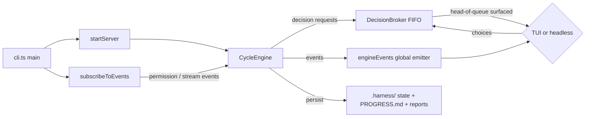
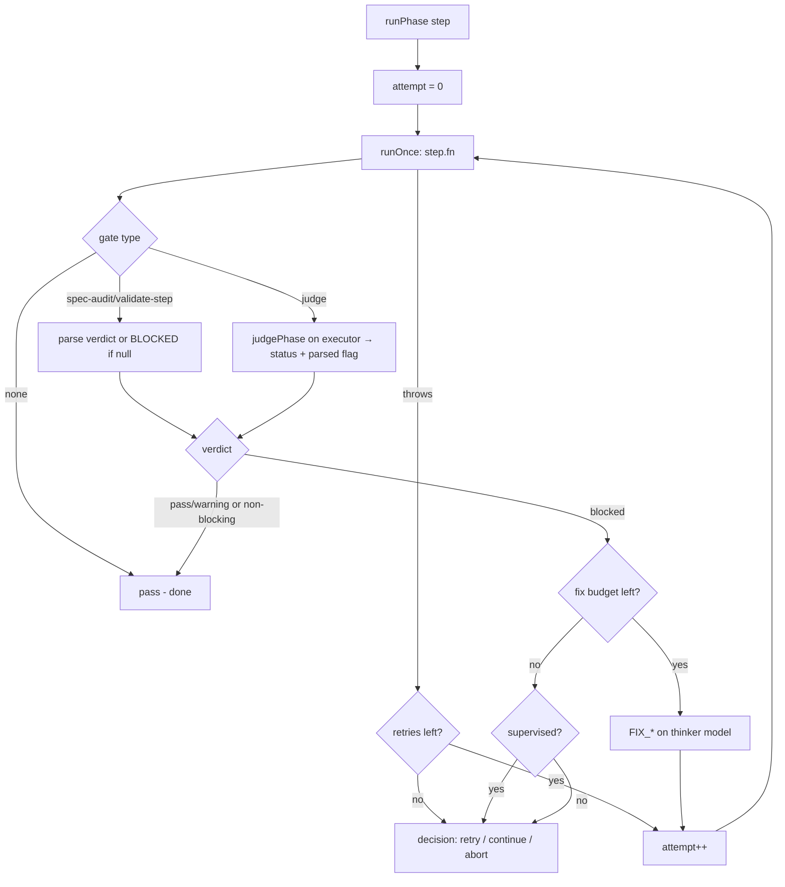
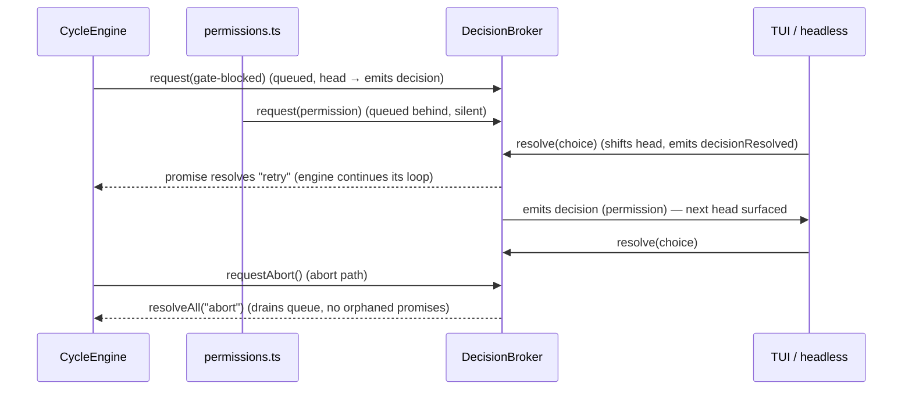
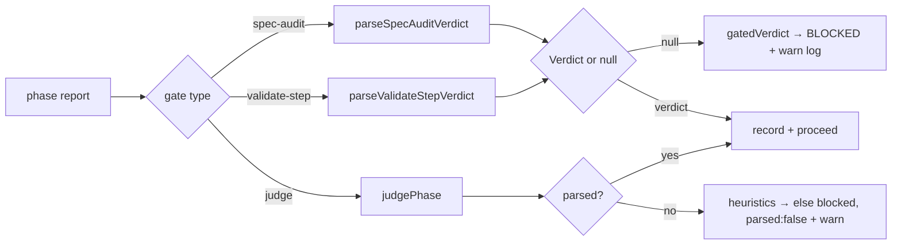
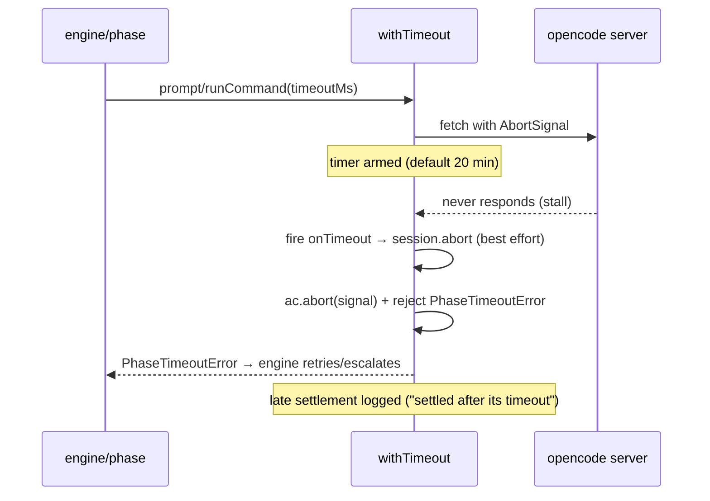
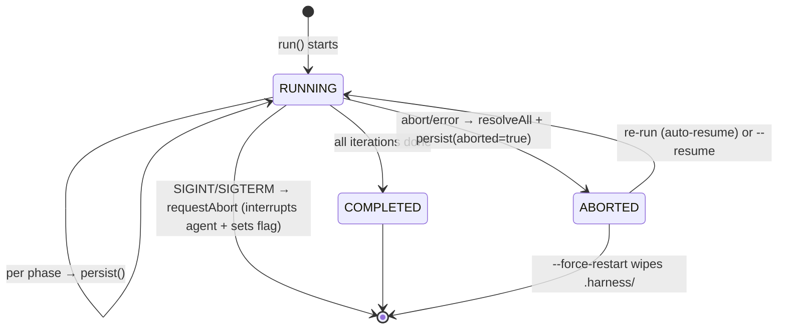

# Huginn — Technical Design

This document describes how huginn is built, from the source in `src/`. It is
the implementation counterpart to [`SPEC.md`](./SPEC.md) and the decisions are
rationalized in [`ADR.md`](./ADR.md).

## 1. Runtime and dependencies

- **Runtime**: [Bun](https://bun.sh). The `bin` entry `huginn` → `dist/cli.js`,
  produced by `bun build src/cli.ts --target=bun --outdir=dist --minify`.
- **Dependencies actually imported in `src/`**:
  - `@opencode-ai/sdk` — typed HTTP client for the opencode server.
  - `ink` + `react` — the TUI dashboard.
  - `zod` — `HarnessState` schema validation.
  - `chalk` — ANSI colors in the banner (`src/banner.ts`), headless frontend
    (`src/headless.ts`), CLI output (`src/cli.ts`), plan mode
    (`src/engine/planMode.ts`), shared formatting (`src/format.ts`), and the
    update reminder (`src/update.ts`).
- `react-devtools-core` is declared in `package.json` but not imported
  anywhere in `src/` (declared, unused — do not rely on it).
- **External executables**: `opencode` (spawned as a local server), `git`
  (spawned for diffs and module inference). Nothing else.

## 2. Module map

```
src/
├── cli.ts                  entry point; arg parsing (run/live/plan/install), config, banner, lifecycle wiring
├── config.ts               RunConfig type (all run-mode knobs)
├── banner.ts               ASCII banner + path shortening
├── format.ts               shared formatting: durations, verdict badges/icons/colors
├── headless.ts             stdout frontend; stdin decision answering; runLiveHeadless
├── update.ts               background npm version check (cache + semver compare + reminder)
├── engine/
│   ├── cycle.ts            CycleEngine: pipeline-as-data, retry/fix/escalate loop, state machine
│   ├── phases.ts           the 8 phase functions + 3 fix functions; builds prompts/commands
│   ├── gate.ts             verdict parsers, JSON judge, fail-closed logic
│   ├── decisionBroker.ts   FIFO queue of pending human/permission decisions
│   ├── permissions.ts      opencode event subscription: permission handling + stream forwarding
│   ├── planMode.ts         `huginn plan`: drafts spec/adr/plan via the thinker; exported prompt
│   │                       builders + draft-format contract reused by live mode
│   ├── liveMode.ts         LiveEngine: chat-refine → scope → draft → approve → handoff to CycleEngine
│   ├── liveRepo.ts         live-mode git helpers: repo context, intent-to-add staging, docs commit
│   ├── modelRouter.ts      "provider/model" → {providerID, modelID} + back
│   ├── diff.ts             git helpers, inferModules, hasImplementationCode (greenfield detection)
│   ├── engineEvents.ts     global typed event emitter
│   └── types.ts            shared types (Verdict, PhaseName, DecisionRequest, …)
├── server/
│   ├── lifecycle.ts        spawn/kill `opencode serve`, health polling, server.log
│   └── client.ts           SDK wrapper: createClient, prompt/runCommand, withTimeout
├── setup/
│   └── install.ts          template discovery, install/uninstall bookkeeping
├── state/
│   ├── store.ts            .harness/ layout, atomic state persistence, progress markdown
│   └── schema.ts           zod schema for HarnessState/HistoryEntry
├── plan/
│   ├── parser.ts           plan.md → Iteration[]
│   └── types.ts            Iteration type
└── tui/
    ├── app.tsx             runTui entry
    ├── render.tsx          ink render + engine.run() error bridge; renderLiveTui
    ├── Dashboard.tsx       the run-cycle dashboard component
    └── LiveDashboard.tsx   the live-mode dashboard (chat, stage, approval box)
scripts/postinstall.ts       bun install hook → installer prompt
templates/{agents,commands}/ opencode agent/command definitions bundled as markdown
```

### Runtime wiring (`src/cli.ts` → engine → frontends)



`CycleEngine` is transport-agnostic: it never touches the terminal. Both
frontends (Ink TUI, stdin headless) are thin adapters over the global `events`
emitter plus `engine.resolveDecision()`.

## 3. The cycle: pipeline-as-data

The core structure is a **data table** instead of hardcoded phase code
(`src/engine/cycle.ts`):

```ts
interface PipelineStep {
  phase: PhaseName;          // SPEC_AUDIT | EXECUTE | ... | COMMIT_ALL
  fn: PhaseFn;               // the phase function from phases.ts
  gate: "spec-audit" | "validate-step" | "judge" | "none";
  fixPhase: PhaseName | null; // FIX_* phase to run when blocked
  fixLabel: string;
  blocking: boolean;
}
```

| phase | fn | gate | fixPhase | blocking |
|---|---|---|---|---|
| SPEC_AUDIT | `specAudit` | spec-audit | FIX_SPEC | ✅ |
| EXECUTE | `execute` | none | — | — |
| VALIDATE_STEP | `validateStep` | validate-step | FIX_VALIDATE | ✅ |
| TEST_MODULE | `testModule` | judge | FIX_TEST | ✅ |
| SECURE_CHECK | `secureCheck` | judge | FIX_SECURITY | ✅ |
| REVIEW | `review` | judge | FIX_REVIEW | ✅ |
| DOC_SYNC | `docSync` | none | — | — |
| COMMIT_ALL | `commitAll` | none | — | — |

The retry/fix/escalation loop (`runPhase`) is the same for every step:



Key behaviors:

- **Greenfield skip**: `SPEC_AUDIT` never runs against a repo with no
  implementation code. `hasImplementationCode` (`src/engine/diff.ts`)
  classifies the repo from `git ls-files --cached --others --exclude-standard`
  — a file counts when it has a source extension from `SOURCE_EXTENSIONS`, is
  not in an ignored dir, and is not a hidden or doc file (config/scaffolding/
  docs don't count). When false, the phase is recorded with verdict `skipped`
  (`recordSkippedSpecAudit`): a history entry and verdict event, but no agent
  call and **no attempt counted** (`phaseAttempts` untouched, so a later real
  audit on resume still starts at attempt 1).
- **Attempt counting** is per `iteration:phase` and persisted in
  `state.phaseAttempts`, so resume continues the numbering (`state.phaseAttempts[key]`).
- **Phase exceptions** (provider stall, timeout, API error) are treated like a
  blocked gate for retry purposes but *never* trigger a thinker fix — they retry
  then escalate (`recordError` writes a `blocked` history entry with a report).
- **Empty `EXECUTE` reports fail closed**: `session.prompt` can resolve on a
  step boundary (e.g. a reasoning-only turn) while the build agent is still
  working, yielding a report with no output. An empty `EXECUTE` result is
  thrown as a phase failure — retried, then escalated — never counted as a pass.
- **Fix phases close their UI row**: `recordFix` emits a `pass` verdict and a
  `phaseEnd` for the `FIX_*` phase (after `runPhase` already emitted its
  `phaseStart`), so the dashboard's fix row terminates with a verdict instead
  of hanging in a spinner state.
- **`retry` from a decision resets the whole budget** (`attemptRun = -1`), so a
  human can keep fixing manually and re-running.
- **`--only-phase`** runs just one step per iteration and leaves state
  resumable: no `finishedAt` is written and `done` is set after the single phase.

## 4. The decision flow (DecisionBroker)

Decisions come from multiple producers:

1. The **engine** — `gate-blocked` escalations, `approve-draft`, `scope-extraction`, and `draft-format` decisions (`requestDecision`).
2. The **event subscription** — `permission` and `question` requests in
   `--permissions ask` mode (`subscribeToEvents` in `src/engine/permissions.ts`).

Both funnel into one FIFO broker (`src/engine/decisionBroker.ts`):



Why FIFO matters: both request kinds can be in flight at once. If the UI
rendered only "the latest" request and resolved that one, the earlier promise
would never settle and the engine's `await` would hang forever. Surfacing only
the head and resolving in arrival order guarantees every request gets exactly
one answer. `resolveAll` on abort/error is the safety net that guarantees no
pending `await` outlives the run.

Frontend mapping of choices:

- Headless TTY: `r`/`c`/`a` (gate), `a`/`o`/`d` (permission).
- Headless non-TTY: permission → `deny`, gate → `abort` (state preserved for resume).
- TUI: same keys; `space`/`p` toggles engine pause (polled every 200 ms), `q`/`Esc` aborts.
- Permission `ask` answers map to opencode responses: `deny`→`reject`,
  `continue`→`always`, `retry`→`once`.

## 5. Gate model



- The two parser functions return `Verdict | null`. `null` means "no parseable
  marker" and the engine's `gatedVerdict()` maps it to `blocked` with a warning
  — **fail closed**.
- `validate-step` verdicts merge every signal by severity (`blocked > warning >
  pass`): the `### Overall gate:` line, the trailing handoff markers from
  `templates/commands/validate-step.md`, and near-miss prose. Severity merging
  means a contradiction (e.g. a 🟢 overall gate plus a `🛑 BLOCKED` handoff)
  can never downgrade the report; the prose signals are negation-aware so a
  clean report listing what it does NOT contain (`no 🔴`, `not blocked`) is not
  misread.
- `spec-audit` verdicts come from the `Overall fidelity:` line or the bare
  keywords `MAJOR DEVIATION` / `MINOR DRIFT` / `ALIGNED`.
- `judgePhase` asks the **executor** model to classify a report as strict JSON
  (`extractJson` does brace-matching extraction; `normalizeJudgeOutput`
  validates the shape). Reports are truncated to 24 000 chars before judging.
  If the judge's own output can't be parsed, keyword heuristics run, and if
  those also fail the gate fails closed to `blocked` (`parsed: false` is logged
  so unreadable-judge events are distinguishable).
- Non-blocking steps (`EXECUTE`, `DOC_SYNC`, `COMMIT_ALL`) record their verdict
  but never stop the pipeline.
- `skipped` is a fourth `Verdict` value that lives *outside* the gate model: it
  is never returned by the two parsers or the judge — only by the greenfield
  `SPEC_AUDIT` skip — and it neither passes nor blocks the pipeline. The
  progress renderer and both frontends treat it as a pass-equivalent
  (`⏭️` icon) for display.

## 6. Timeout model

Every model interaction goes through `withTimeout` (`src/server/client.ts`):



- `timeoutMs <= 0` disables the deadline entirely (no `AbortController`).
- On timeout the **local fetch is aborted** *and* the **server-side agent is
  interrupted** via `client.session.abort` (best effort), so the provider isn't
  left churning.
- Settlements that race the timeout are logged (`request settled after its
  timeout; the provider may still be processing`) instead of corrupting results.
- The same mechanism backs `huginn plan`'s and `huginn live`'s 20-minute
  drafting/chat prompts (`PLAN_PROMPT_TIMEOUT_MS` / `LIVE_PROMPT_TIMEOUT_MS`).

## 7. State machine and resume

State is one zod-validated document, `HarnessState` (`src/state/schema.ts`):



- **Checkpoints**: `persist()` (write `state.json` atomically via tmp+rename,
  regenerate `PROGRESS.md`, emit `stateUpdated`) runs after every phase, after
  fixes, after session creation, and at iteration boundaries. The engine only
  checks the abort flag between steps, so an abort always lands on a consistent
  checkpoint. Requesting an abort (`requestAbort`) additionally interrupts the
  in-flight agent session (`abortSession`, `src/server/client.ts`) so the loop
  observes the abort immediately instead of waiting out a long phase timeout;
  the run's catch path then reports the outcome as *aborted*, not *error*.
- **Resume hash**: `computePlanHash([plan, spec, adr])` is SHA-256 over
  `basename \0 contents \0` per file. Because it uses basenames, the hash is
  identical after the repo is moved/cloned elsewhere (verified by
  `src/state/store.test.ts`). `run` refuses to resume a run whose documents
  changed, unless `--ignore-plan-changes`; `--force-restart` wipes everything.
- **Resume point**: `currentIteration`/`currentPhase` select the exact step.
  `runIteration` captures the resume phase once, then skips steps until it is
  reached (`pastResume` flag); `phaseAttempts` carries over so attempt numbers
  stay monotonic.
- **Session reuse**: `iterationSessionId` is reused when it still exists on the
  server; otherwise a fresh session `iter N: <title>` is created. `--only-phase`
  keeps state resumable (no `finishedAt` written), matching `PROGRESS.md`'s
  RUNNING status.
- **Models on resume**: the saved models/mode are *replaced* by the current
  flags (`state = { ...existing, models, mode }`), so re-running with different
  models is intentional and allowed.
- **Progress counting**: `renderProgressMarkdown` counts only `MAIN_PHASES`
  entries with `pass`/`warning`/`skipped` — the `done/8` gauge can never
  exceed 8 no matter how many `FIX_*` attempts happened.

## 8. Live mode

`huginn live` is a second frontend-agnostic engine, `LiveEngine`
(`src/engine/liveMode.ts`), that deliberately reuses the pieces `run` already
has instead of inventing new ones:

- **One opencode session** per live session (`huginn live: <project>`), exactly
  like the cycle's per-iteration session; every model call is `prompt` with the
  **thinker** model and the same 20-minute `withTimeout` budget.
- **The DecisionBroker** (`src/engine/decisionBroker.ts`) answers the three
  live decision kinds (`approve-draft`, `scope-extraction`, `draft-format`).
  After handoff to the cycle, `ask`/`resolveDecision`/`requestAbort` delegate
  to the `CycleEngine` instance, so the FIFO queue is shared, not doubled.
- **The plan-mode prompt builders** (`updateSpecPrompt`, `appendAdrPrompt`,
  `remainingPlanPrompt`, `validateDraftFormat`, `OUTPUT_FORMAT_CONTRACT`,
  `unwrapFences` — all exported from `src/engine/planMode.ts`) do the actual
  drafting; live mode adds the format-contract loop around them (validate →
  retry once with feedback → `draft-format` human decision).
- **git as the review surface**: drafted docs are staged as intent-to-add
  (`git add -N`, `stageDocsForReview`) so `git diff HEAD -- spec.md adr.md
  plan.md` shows the drafts; abort drops the staging (`unstageDocs`); approval
  commits them (`commitDocs`, subject `docs(scope): <first line of scope>`)
  and clears stale `.harness/` state before a fresh `CycleEngine` takes over.

```mermaid
sequenceDiagram
    participant U as User (TUI chat / headless idea)
    participant L as LiveEngine
    participant B as DecisionBroker
    participant P as planMode builders
    participant C as CycleEngine

    U->>L: chat(msg) ×N (refine stage)
    U->>L: /draft
    L->>L: extractScope (SCOPE: block, fail-closed)
    L->>P: updateSpecPrompt / appendAdrPrompt / remainingPlanPrompt
    P-->>L: drafted docs (format-contract validated)
    L->>U: stageDocsForReview → git diff HEAD review
    L->>B: approve-draft decision
    B-->>U: head surfaced; choice → L
    U-->>B: continue
    L->>C: commitDocs + resetHarnessState → new CycleEngine
    C-->>U: full 8-phase cycle (same dashboard/session)
```

Scope extraction is the one genuinely new contract: the thinker must answer
with a `SCOPE:` line + fenced markdown block; a missing/unparseable block is
treated like any other gate — fail closed to a human decision
(`scope-extraction`: retry, or fall back to the user's last message).

- **Interactive TUI & Markdown Rendering** (`src/tui/LiveDashboard.tsx`, `src/tui/markdown.tsx`):
  - Two parallel scrollable cards (`ScrollableChatCard` for human-thinker dialogue, `ScrollableStreamCard` for real-time thinking and reasoning tokens) rendered concurrently.
  - `[Tab]` toggles active card focus with visual border highlighting (`cyanBright` on the active panel).
  - `[PageUp]` / `[PageDown]` scrolls the focused card by 4 lines at any time without losing in-flight input; arrow keys `[↑]` / `[↓]` scroll line-by-line when input is empty or stream is focused.
  - Native terminal Markdown token rendering via `MarkdownLine` formats inline bold, italic, code backticks, headers, bullet points, numbered lists, and code blocks natively in Ink.
  - Post-execution continuous loop: upon completing all plan iterations in `live` mode, a `post-cycle-live` decision modal prompts the user to either exit cleanly (`[c]` / `[a]`) or return to the live refinement loop (`[r]`) with state and thinker context preserved for the next set of tasks.

## 9. Concurrency and event model

The engine is single-threaded and awaits everything, but three sources of
asynchrony interleave:

1. **The opencode event stream** (`subscribeToEvents`) — a long-lived SSE loop
   that can fire a `permission.updated` request *while* the engine awaits a
   gate decision → this is exactly why the DecisionBroker exists. It also
   forwards agent activity to the frontends: text/reasoning deltas and
   tool-execution status into `phaseStream` (as synthetic marker lines such as
   `⚡ [tool: …] running` / `✓ … completed` / `✗ … error` and `📝 Edited file:
   …`), and file-edit / todo-update events into `log`.
2. **The engine's own retry/escalation loop** — driven by the same await chain.
3. **Frontends** — subscribe to `events` and resolve decisions independently.
   Live mode adds two more subscribers (`LiveDashboard.tsx` in the TUI,
   `runLiveHeadless` in headless) consuming `liveStage`/`liveChat`, which hand
   off to the same run-cycle rendering once the docs are approved.

Communication is via a single **global typed emitter**
(`src/engine/engineEvents.ts`):

| event | payload | consumers |
|---|---|---|
| `iterationStart` | iteration, totalIterations, title, modules | TUI header, headless iteration banner |
| `iterationEnd` | iteration, title | (currently no subscriber — reserved) |
| `phaseStart` | iteration, totalIterations, iterationTitle, phase, attempt, model, startedAt | TUI header, headless |
| `phaseStream` | text/reasoning deltas + tool-execution & file-edit marker lines | live output tail |
| `phaseEnd` | full PhaseResult + durationMs | report bar |
| `decision` / `decisionResolved` | request / id+choice | decision box |
| `verdict` | iteration, phase, verdict, attempt, durationMs | phase checklist |
| `log` | level + message + timestamp | log tail |
| `stateUpdated` | HarnessState | emitted after every `persist()`; currently no subscriber (reserved for future state UI) |
| `liveStage` | stage (`refine`/`draft`/`approve`/`execute`) + optional message | LiveDashboard stage header |
| `liveChat` | role (`user`/`assistant`/`system`) + text | LiveDashboard chat panel, headless live chat lines |
| `done` | reason + optional error | TUI exit, run summary |

Listener exceptions are caught and logged per-listener, so a broken subscriber
can't kill the engine. All frontends subscribe and unsubscribe in `finally`
blocks. The only cross-cutting wiring done outside the engines is
`subscribeToEvents`, which is handed the engine's `ask()` as its decision
callback — one line in `cli.ts` (`(req) => engine.ask(req)` / `(req) => live.ask(req)`).

## 10. Installer design

```mermaid
flowchart LR
    A[bun install] --> B[scripts/postinstall.ts]
    B --> C{all 11 present?}
    C -- yes --> Z[silent exit 0]
    C -- no --> D[promptYesNo]
    D -- no --> Z
    D -- yes --> E[installTemplates]
    F[huginn install] --> E
    E --> G[copy templates/{agents,commands}/*.md → ~/.config/opencode/...]
    G --> H{file exists?}
    H -- yes, no force --> I[skip]
    H -- no --> J[copy + chmod 0644]
    H -- yes, force --> J
```

- `REQUIRED_TEMPLATES` is a fixed list of 11 entries (5 agents + 6 commands)
  and doubles as the runtime contract: `huginn run`/`plan` warn when any is
  missing.
- `findTemplatesRoot()` walks up at most 8 directory levels from
  `import.meta.dir` looking for `templates/{agents,commands}`, which makes the
  same code work from `src/` (dev), `dist/` (bundled bin) and `scripts/`
  (postinstall). `HUGINN_TEMPLATES_DIR` short-circuits the walk.
- The destination defaults to `~/.config/opencode` and is overridable via
  `HUGINN_OPENCODE_CONFIG_DIR` — this is how the installer tests isolate
  themselves from the real config dir.
- No-overwrite is deliberate: opencode config may be personalized, and the
  agent/command files are the user's, not huginn's. `--force` exists for
  re-bundling.

## 11. Key invariants

1. **Fail closed**: no path exists where an unparseable gate report becomes a
   pass. (`gatedVerdict`, judge fallback, both tests.)
2. **Every decision gets exactly one answer**: FIFO + `resolveAll` on abort.
3. **No state loss**: `state.json` is only ever replaced atomically; the `run`
   cycle never touches plan/spec/adr — the only writers are `plan` mode (at
   creation time) and live mode (human-approved drafts, committed via git).
4. **`.harness/` never participates in the build**: excluded in `.gitignore`
   and filtered out of every git-diff-based helper.
5. **The pipeline table is the only place phase wiring lives**: adding a phase
   is adding one row (plus its `phases.ts` function and template command).
   The phase-name lists that mirror the pipeline — `MAIN_PHASES`
   (`src/engine/types.ts`), the TUI's `BASE_PHASES` (`src/tui/Dashboard.tsx`)
   and `PHASE_LABEL` (`src/state/store.ts`) — are duplicated by hand and must
   be updated in the same change.
6. **The engine never blocks on a human forever in unattended mode**: non-TTY
   headless aborts gate decisions rather than hanging.

## 12. Key tradeoffs (summary; full rationale in ADR.md)

- Pipeline-as-data buys uniform retry/escalation logic at the cost of
  phase-specific control flow living inside the table's `fixPhase`/`fixLabel`
  indirection.
- A single global emitter is simple and decouples the engine from the UI, but
  means any state the dashboard keeps must be re-derived from events (it cannot
  reach into the engine beyond `getState`).
- Bundled markdown templates are transparent and user-editable but can drift
  from what the engine's parsers expect — the parser regexes are the contract,
  and the templates are the other side of it.
- All model traffic is synchronous request/response through one opencode
  session per iteration; parallelism (multiple agents at once) is deliberately
  not attempted, which keeps verdict ordering and state trivial.
