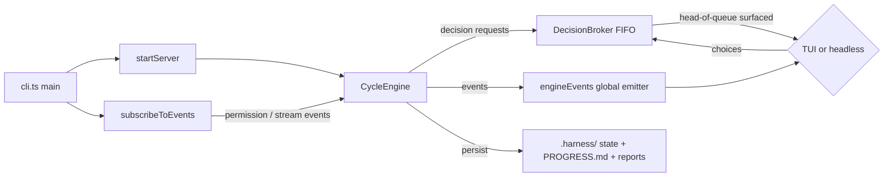
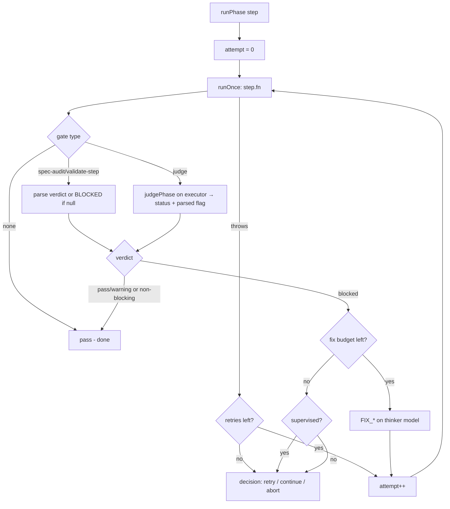
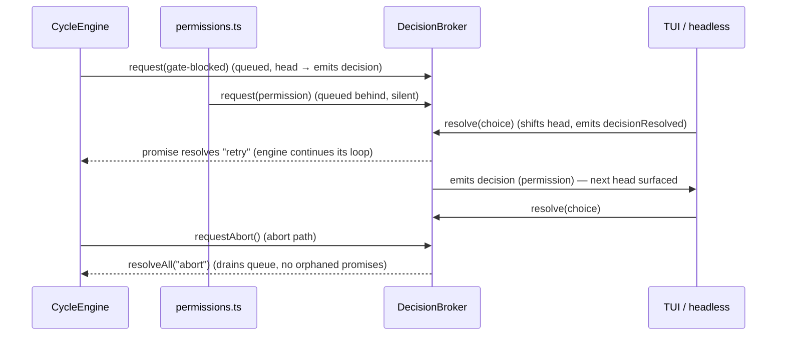
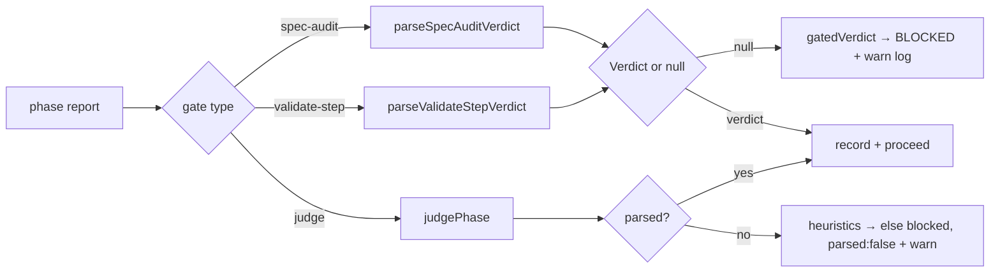
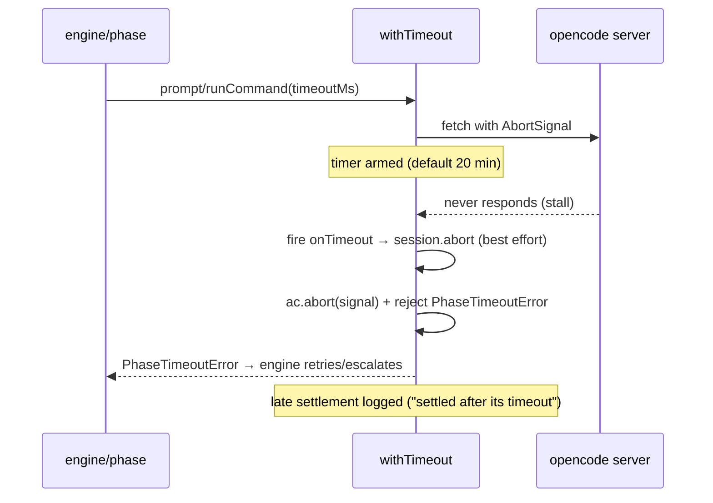
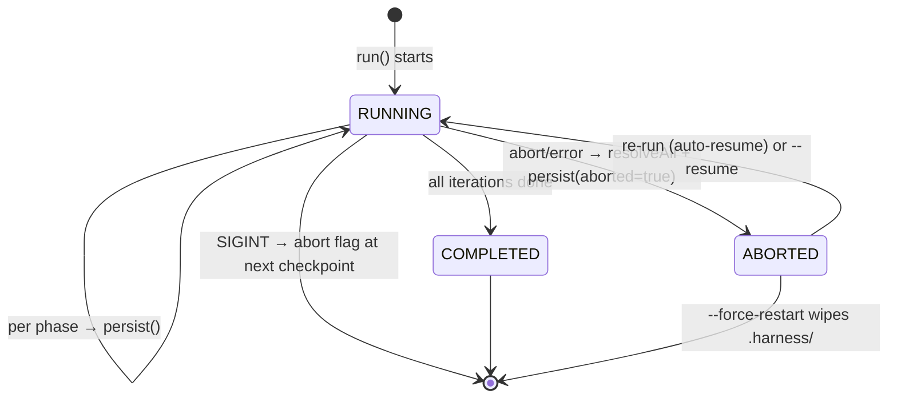

# Huginn — Technical Design

This document describes how huginn is built, from the source in `src/`. It is
the implementation counterpart to [`SPEC.md`](./SPEC.md) and the decisions are
rationalized in [`ADR.md`](./ADR.md).

## 1. Runtime and dependencies

- **Runtime**: [Bun](https://bun.sh). The `bin` entry `huginn` → `dist/cli.js`,
  produced by `bun build src/cli.ts --target=bun --outdir=dist --minify`.
- **Dependencies actually imported in `src/`**:
  - `@opencode-ai/sdk` — typed HTTP client for the opencode server.
  - `ink` + `react` — the TUI dashboard.
  - `zod` — `HarnessState` schema validation.
- `chalk` and `react-devtools-core` are declared in `package.json` but not
  imported anywhere in `src/` (declared, unused — do not rely on them).
- **External executables**: `opencode` (spawned as a local server), `git`
  (spawned for diffs and module inference). Nothing else.

## 2. Module map

```
src/
├── cli.ts                  entry point; arg parsing (run/plan/install), config, banner, lifecycle wiring
├── config.ts               RunConfig type (all run-mode knobs)
├── banner.ts               ASCII banner + path shortening
├── headless.ts             stdout frontend; stdin decision answering
├── engine/
│   ├── cycle.ts            CycleEngine: pipeline-as-data, retry/fix/escalate loop, state machine
│   ├── phases.ts           the 8 phase functions + 3 fix functions; builds prompts/commands
│   ├── gate.ts             verdict parsers, JSON judge, fail-closed logic
│   ├── decisionBroker.ts   FIFO queue of pending human/permission decisions
│   ├── permissions.ts      opencode event subscription: permission handling + stream forwarding
│   ├── planMode.ts         `huginn plan`: drafts spec/adr/plan via the thinker
│   ├── modelRouter.ts      "provider/model" → {providerID, modelID} + back
│   ├── diff.ts             git helpers + inferModules
│   ├── engineEvents.ts     global typed event emitter
│   └── types.ts            shared types (Verdict, PhaseName, DecisionRequest, …)
├── server/
│   ├── lifecycle.ts        spawn/kill `opencode serve`, health polling, server.log
│   └── client.ts           SDK wrapper: createClient, prompt/runCommand, withTimeout
├── setup/
│   └── install.ts          template discovery, install/uninstall bookkeeping
├── state/
│   ├── store.ts            .harness/ layout, atomic state persistence, progress markdown
│   └── schema.ts           zod schema for HarnessState/HistoryEntry
├── plan/
│   ├── parser.ts           plan.md → Iteration[]
│   └── types.ts            Iteration type
└── tui/
    ├── app.tsx             runTui entry
    ├── render.tsx          ink render + engine.run() error bridge
    └── Dashboard.tsx       the dashboard component
scripts/postinstall.ts       bun install hook → installer prompt
templates/{agents,commands}/ opencode agent/command definitions bundled as markdown
```

### Runtime wiring (`src/cli.ts` → engine → frontends)



`CycleEngine` is transport-agnostic: it never touches the terminal. Both
frontends (Ink TUI, stdin headless) are thin adapters over the global `events`
emitter plus `engine.resolveDecision()`.

## 3. The cycle: pipeline-as-data

The core structure is a **data table** instead of hardcoded phase code
(`src/engine/cycle.ts`):

```ts
interface PipelineStep {
  phase: PhaseName;          // SPEC_AUDIT | EXECUTE | ... | COMMIT_ALL
  fn: PhaseFn;               // the phase function from phases.ts
  gate: "spec-audit" | "validate-step" | "judge" | "none";
  fixPhase: PhaseName | null; // FIX_* phase to run when blocked
  fixLabel: string;
  blocking: boolean;
}
```

| phase | fn | gate | fixPhase | blocking |
|---|---|---|---|---|
| SPEC_AUDIT | `specAudit` | spec-audit | FIX_SPEC | ✅ |
| EXECUTE | `execute` | none | — | — |
| VALIDATE_STEP | `validateStep` | validate-step | FIX_VALIDATE | ✅ |
| TEST_MODULE | `testModule` | judge | FIX_TEST | ✅ |
| SECURE_CHECK | `secureCheck` | judge | FIX_SECURITY | ✅ |
| REVIEW | `review` | judge | FIX_REVIEW | ✅ |
| DOC_SYNC | `docSync` | none | — | — |
| COMMIT_ALL | `commitAll` | none | — | — |

The retry/fix/escalation loop (`runPhase`) is the same for every step:



Key behaviors:

- **Attempt counting** is per `iteration:phase` and persisted in
  `state.phaseAttempts`, so resume continues the numbering (`state.phaseAttempts[key]`).
- **Phase exceptions** (provider stall, timeout, API error) are treated like a
  blocked gate for retry purposes but *never* trigger a thinker fix — they retry
  then escalate (`recordError` writes a `blocked` history entry with a report).
- **`retry` from a decision resets the whole budget** (`attemptRun = -1`), so a
  human can keep fixing manually and re-running.
- **`--only-phase`** runs just one step per iteration and leaves state
  resumable: no `finishedAt` is written and `done` is set after the single phase.

## 4. The decision flow (DecisionBroker)

Decisions come from two independent producers:

1. The **engine** — `gate-blocked` escalations (`requestDecision`).
2. The **permission event subscription** — `permission` requests in
   `--permissions ask` mode (`subscribeToEvents` in `src/engine/permissions.ts`).

Both funnel into one FIFO broker (`src/engine/decisionBroker.ts`):



Why FIFO matters: both request kinds can be in flight at once. If the UI
rendered only "the latest" request and resolved that one, the earlier promise
would never settle and the engine's `await` would hang forever. Surfacing only
the head and resolving in arrival order guarantees every request gets exactly
one answer. `resolveAll` on abort/error is the safety net that guarantees no
pending `await` outlives the run.

Frontend mapping of choices:

- Headless TTY: `r`/`c`/`a` (gate), `a`/`o`/`d` (permission).
- Headless non-TTY: permission → `deny`, gate → `abort` (state preserved for resume).
- TUI: same keys; `space`/`p` toggles engine pause (polled every 200 ms), `q`/`Esc` aborts.
- Permission `ask` answers map to opencode responses: `deny`→`reject`,
  `continue`→`always`, `retry`→`once`.

## 5. Gate model



- The two parser functions return `Verdict | null`. `null` means "no parseable
  marker" and the engine's `gatedVerdict()` maps it to `blocked` with a warning
  — **fail closed**.
- `validate-step` markers (from `templates/commands/validate-step.md`'s human
  handoff) are checked before the secondary `Overall gate:` line.
- `spec-audit` verdicts come from the `Overall fidelity:` line or the bare
  keywords `MAJOR DEVIATION` / `MINOR DRIFT` / `ALIGNED`.
- `judgePhase` asks the **executor** model to classify a report as strict JSON
  (`extractJson` does brace-matching extraction; `normalizeJudgeOutput`
  validates the shape). Reports are truncated to 24 000 chars before judging.
  If the judge's own output can't be parsed, keyword heuristics run, and if
  those also fail the gate fails closed to `blocked` (`parsed: false` is logged
  so unreadable-judge events are distinguishable).
- Non-blocking steps (`EXECUTE`, `DOC_SYNC`, `COMMIT_ALL`) record their verdict
  but never stop the pipeline.

## 6. Timeout model

Every model interaction goes through `withTimeout` (`src/server/client.ts`):



- `timeoutMs <= 0` disables the deadline entirely (no `AbortController`).
- On timeout the **local fetch is aborted** *and* the **server-side agent is
  interrupted** via `client.session.abort` (best effort), so the provider isn't
  left churning.
- Settlements that race the timeout are logged (`request settled after its
  timeout; the provider may still be processing`) instead of corrupting results.
- The same mechanism backs `huginn plan`'s 20-minute draft prompts.

## 7. State machine and resume

State is one zod-validated document, `HarnessState` (`src/state/schema.ts`):



- **Checkpoints**: `persist()` (write `state.json` atomically via tmp+rename,
  regenerate `PROGRESS.md`, emit `stateUpdated`) runs after every phase, after
  fixes, after session creation, and at iteration boundaries. The engine only
  checks the abort flag between steps, so an abort always lands on a consistent
  checkpoint.
- **Resume hash**: `computePlanHash([plan, spec, adr])` is SHA-256 over
  `basename \0 contents \0` per file. Because it uses basenames, the hash is
  identical after the repo is moved/cloned elsewhere (verified by
  `src/state/store.test.ts`). `run` refuses to resume a run whose documents
  changed, unless `--ignore-plan-changes`; `--force-restart` wipes everything.
- **Resume point**: `currentIteration`/`currentPhase` select the exact step.
  `runIteration` captures the resume phase once, then skips steps until it is
  reached (`pastResume` flag); `phaseAttempts` carries over so attempt numbers
  stay monotonic.
- **Session reuse**: `iterationSessionId` is reused when it still exists on the
  server; otherwise a fresh session `iter N: <title>` is created. `--only-phase`
  keeps state resumable (no `finishedAt` written), matching `PROGRESS.md`'s
  RUNNING status.
- **Models on resume**: the saved models/mode are *replaced* by the current
  flags (`state = { ...existing, models, mode }`), so re-running with different
  models is intentional and allowed.
- **Progress counting**: `renderProgressMarkdown` counts only `MAIN_PHASES`
  entries with `pass`/`warning` — the `done/8` gauge can never exceed 8 no
  matter how many `FIX_*` attempts happened.

## 8. Concurrency and event model

The engine is single-threaded and awaits everything, but three sources of
asynchrony interleave:

1. **The opencode event stream** (`subscribeToEvents`) — a long-lived SSE loop
   that can fire a `permission.updated` request *while* the engine awaits a
   gate decision → this is exactly why the DecisionBroker exists.
2. **The engine's own retry/escalation loop** — driven by the same await chain.
3. **Frontends** — subscribe to `events` and resolve decisions independently.

Communication is via a single **global typed emitter**
(`src/engine/engineEvents.ts`):

| event | payload | consumers |
|---|---|---|
| `phaseStart` | iteration, phase, attempt, model | TUI header, headless |
| `phaseStream` | text delta | live output tail |
| `phaseEnd` | full PhaseResult | report bar |
| `decision` / `decisionResolved` | request / id+choice | decision box |
| `verdict` | iteration, phase, verdict, attempt | phase checklist |
| `log` | level + message | log tail |
| `stateUpdated` | HarnessState | emitted after every `persist()`; currently no subscriber (reserved for future state UI) |
| `done` | reason + optional error | TUI exit, run summary |

Listener exceptions are caught and logged per-listener, so a broken subscriber
can't kill the engine. Both frontends subscribe and unsubscribe in `finally`
blocks. The only cross-cutting wiring done outside the engine is
`subscribeToEvents`, which is handed `engine.ask()` as its decision callback —
one line in `cli.ts` (`(req) => engine.ask(req)`).

## 9. Installer design

```mermaid
flowchart LR
    A[bun install] --> B[scripts/postinstall.ts]
    B --> C{all 11 present?}
    C -- yes --> Z[silent exit 0]
    C -- no --> D[promptYesNo]
    D -- no --> Z
    D -- yes --> E[installTemplates]
    F[huginn install] --> E
    E --> G[copy templates/{agents,commands}/*.md → ~/.config/opencode/...]
    G --> H{file exists?}
    H -- yes, no force --> I[skip]
    H -- no --> J[copy + chmod 0644]
    H -- yes, force --> J
```

- `REQUIRED_TEMPLATES` is a fixed list of 11 entries (5 agents + 6 commands)
  and doubles as the runtime contract: `huginn run`/`plan` warn when any is
  missing.
- `findTemplatesRoot()` walks up at most 8 directory levels from
  `import.meta.dir` looking for `templates/{agents,commands}`, which makes the
  same code work from `src/` (dev), `dist/` (bundled bin) and `scripts/`
  (postinstall). `HUGINN_TEMPLATES_DIR` short-circuits the walk.
- The destination defaults to `~/.config/opencode` and is overridable via
  `HUGINN_OPENCODE_CONFIG_DIR` — this is how the installer tests isolate
  themselves from the real config dir.
- No-overwrite is deliberate: opencode config may be personalized, and the
  agent/command files are the user's, not huginn's. `--force` exists for
  re-bundling.

## 10. Key invariants

1. **Fail closed**: no path exists where an unparseable gate report becomes a
   pass. (`gatedVerdict`, judge fallback, both tests.)
2. **Every decision gets exactly one answer**: FIFO + `resolveAll` on abort.
3. **No state loss**: `state.json` is only ever replaced atomically; the run
   never touches plan/spec/adr.
4. **`.harness/` never participates in the build**: excluded in `.gitignore`
   and filtered out of every git-diff-based helper.
5. **The pipeline table is the only place phase wiring lives**: adding a phase
   is adding one row (plus its `phases.ts` function and template command).
6. **The engine never blocks on a human forever in unattended mode**: non-TTY
   headless aborts gate decisions rather than hanging.

## 11. Key tradeoffs (summary; full rationale in ADR.md)

- Pipeline-as-data buys uniform retry/escalation logic at the cost of
  phase-specific control flow living inside the table's `fixPhase`/`fixLabel`
  indirection.
- A single global emitter is simple and decouples the engine from the UI, but
  means any state the dashboard keeps must be re-derived from events (it cannot
  reach into the engine beyond `getState`).
- Bundled markdown templates are transparent and user-editable but can drift
  from what the engine's parsers expect — the parser regexes are the contract,
  and the templates are the other side of it.
- All model traffic is synchronous request/response through one opencode
  session per iteration; parallelism (multiple agents at once) is deliberately
  not attempted, which keeps verdict ordering and state trivial.
